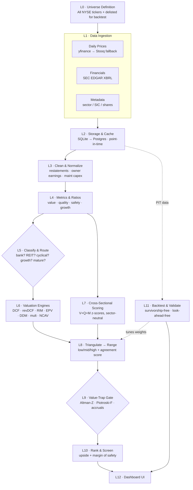

# Stock Valuation Dashboard — System Blueprint

> Goal: analyze the full NYSE universe from free public data, value each company
> with multiple methods, and surface a **fair-value range vs. current price** so
> undervalued candidates rise to the top — with honest confidence signals, not
> false precision.

---

## How to read the confidence ratings

Every step is rated on two separate axes, because they are genuinely different:

- **🛠️ Build confidence** — how sure we are the *engineering works* (code runs, data flows, numbers compute).
- **🎯 Signal confidence** — how sure we are the *output is trustworthy* (the number means something / predicts anything).

Most of this pipeline is **high build / medium signal** — which is the honest truth about all quant valuation work. The software will work. Whether it beats the market is what the backtest (L11) exists to tell you.

Legend: 🟢 high · 🟡 medium · 🔴 low / fragile

---

## Flow Chart

```
┌──────────────────────────────────────────────────────────────┐
│  L0 · UNIVERSE DEFINITION                                      │
│  All NYSE tickers  (+ KEEP delisted tickers for backtest)     │
└──────────────────────────────────────────────────────────────┘
                          │
                          ▼
┌──────────────────────────────────────────────────────────────┐
│  L1 · DATA INGESTION                                           │
│  ┌────────────────┐ ┌──────────────────┐ ┌────────────────┐  │
│  │ Daily prices   │ │ Financials       │ │ Metadata       │  │
│  │ yfinance→Stooq │ │ SEC EDGAR (XBRL) │ │ sector/SIC/shrs│  │
│  └────────────────┘ └──────────────────┘ └────────────────┘  │
└──────────────────────────────────────────────────────────────┘
                          │
                          ▼
┌──────────────────────────────────────────────────────────────┐
│  L2 · STORAGE & CACHE     SQLite→Postgres ·  POINT-IN-TIME     │
└──────────────────────────────────────────────────────────────┘
                          │
                          ▼
┌──────────────────────────────────────────────────────────────┐
│  L3 · CLEAN & NORMALIZE     ⚠ hardest, most judgment-heavy     │
│  restatements · owner earnings · maint. capex · one-offs      │
└──────────────────────────────────────────────────────────────┘
                          │
                          ▼
┌──────────────────────────────────────────────────────────────┐
│  L4 · METRICS & RATIOS      value · quality · safety · growth  │
└──────────────────────────────────────────────────────────────┘
              │                                  │
              ▼                                  ▼
┌──────────────────────────┐      ┌──────────────────────────────┐
│ L5 · CLASSIFY & ROUTE    │      │ L7 · CROSS-SECTIONAL SCORING │
│ bank/REIT/cyclical/      │      │ Value+Quality+Momentum       │
│ growth/mature            │      │ z-scores, sector-neutral     │
└──────────────────────────┘      └──────────────────────────────┘
              │                                  │
              ▼                                  │
┌──────────────────────────┐                    │
│ L6 · VALUATION ENGINES   │                    │
│ (run ONLY applicable)    │                    │
│ DCF·revDCF·RIM·EPV·DDM   │                    │
│ ·warranted-mult·NCAV     │                    │
└──────────────────────────┘                    │
              │                                  │
              └──────────────┬───────────────────┘
                             ▼
┌──────────────────────────────────────────────────────────────┐
│  L8 · TRIANGULATE → RANGE                                      │
│  low / mid / high fair value  +  agreement score (=confidence)│
└──────────────────────────────────────────────────────────────┘
                          │
                          ▼
┌──────────────────────────────────────────────────────────────┐
│  L9 · VALUE-TRAP GATE     Altman-Z · Piotroski-F · accruals   │
└──────────────────────────────────────────────────────────────┘
                          │
                          ▼
┌──────────────────────────────────────────────────────────────┐
│  L10 · RANK & SCREEN      upside vs price + margin of safety   │
└──────────────────────────────────────────────────────────────┘
                          │
                          ▼
┌──────────────────────────────────────────────────────────────┐
│  L12 · DASHBOARD UI                                            │
└──────────────────────────────────────────────────────────────┘

   ╔══════════════════════════════════════════════════════════╗
   ║  L11 · BACKTEST & VALIDATE   (offline; reads L2 PIT data) ║
   ║  survivorship-free · look-ahead-free  →  tunes L8 weights ║
   ╚══════════════════════════════════════════════════════════╝
```

### Mermaid source (for design docs / renderers)



---

## Process Chart (confidence + notes per step)

| # | Step | 🛠️ Build | 🎯 Signal | Key notes & risks |
|---|------|:---:|:---:|------|
| **L0** | Universe definition | 🟢 | — | List changes constantly (IPOs/delistings). Decide upfront: include ADRs? dual-class? sub-$1 penny names? **Keep delisted tickers** or the backtest will lie (survivorship bias). |
| **L1a** | Daily prices | 🟢 | 🟡 | Engineering trivial; *reliability* is the catch — yfinance is unofficial. Build the fallback chain. Adjust for splits/dividends. Expect occasional missing days. |
| **L1b** | Financials (EDGAR) | 🟢 | 🟢 | The bedrock. **Gotcha:** XBRL tags aren't perfectly consistent across companies/years — the same concept (e.g. revenue) appears under different tags. Need a **tag-mapping layer**. EDGAR requires a `User-Agent` header and caps ~10 req/s. |
| **L1c** | Metadata/classification | 🟢 | 🟡 | SIC codes are coarse and sometimes wrong. Holding cos & conglomerates misclassify. Plan a manual-override table. |
| **L2** | Storage & cache | 🟢 | 🟢 | Easy — but **point-in-time discipline is non-negotiable**: store data *as originally reported* with filing dates; never overwrite with restatements. This one design choice makes or breaks L11. |
| **L3** | Clean & normalize | 🟡 | 🟡 | **The hardest step and where most errors enter.** Maintenance capex is an *estimate*. One-time items are hard to detect automatically. Owner-earnings/normalization need rules + judgment. Budget the most time here; everything downstream inherits its mistakes. |
| **L4** | Metrics & ratios | 🟢 | 🟡 | Pure arithmetic (build = easy). Signal quality is 100% inherited from L3. Handle negatives/NM sanely (a negative P/E is meaningless, not "cheap"). |
| **L5** | Classify & route | 🟢 | 🟡 | Routing logic is simple; *correct* classification is the risk (see L1c). A bank run through an FCF model produces garbage — this gate prevents that. Allow manual overrides. |
| **L6 — DCF** | Discounted cash flow | 🟢 | 🔴 | Easy to code, **dangerous to trust alone.** 60–80% of the output is terminal value = pure assumption. Only ever one input among many. Run as Monte Carlo, not a point estimate. |
| **L6 — Reverse DCF** | Market-implied expectations | 🟢 | 🟢 | High value-per-effort. Output ("price implies 12% growth for 10yrs") is interpretable and falsifiable. **Prioritize this.** |
| **L6 — RIM** | Residual income | 🟢 | 🟡 | Book-value-anchored → far less terminal-value-dependent. The only clean intrinsic method for banks/insurers. Sensitive to cost-of-equity assumption. |
| **L6 — EPV** | Earnings power value | 🟢 | 🟡 | Conservative, strips out growth fantasy. Needs *normalized* earnings + correct cost of capital. Great sanity-check anchor. |
| **L6 — DDM** | Dividend discount | 🟢 | 🟡 | Only for stable dividend payers; useless otherwise. Router decides applicability. |
| **L6 — Warranted multiple** | Regression vs peers | 🟡 | 🟡 | Smarter than naive peer averages, but regressions are outlier-sensitive and can be unstable. Winsorize inputs; validate feature set. |
| **L6 — NCAV/asset** | Net-net / tangible book | 🟢 | 🟡 | Rare hits today. Book value can be stale (intangibles, write-downs). Treat as a flag, not a verdict. |
| **L7** | Cross-sectional scoring | 🟡 | 🟡 | **The most empirically-supported approach** — but factor returns are regime-dependent (value lagged most of the 2010s). Must winsorize and sector-neutralize. The scalable screen. |
| **L8** | Triangulate → range | 🟡 | 🟡 | Combination weighting is judgment, not science. Honest design: the **spread of estimates = the range**, and **method agreement = the confidence score**. Never average inapplicable methods in. |
| **L9** | Value-trap gate | 🟢 | 🟡 | Altman-Z / Piotroski-F are well-established and meaningfully cut false positives — but traps still slip through. Flag, don't auto-exclude (a flagged stock is still informative). |
| **L10** | Rank & screen | 🟢 | 🟡 | The deliverable list. Margin-of-safety threshold is a tunable choice (e.g. surface >30% upside *with* high agreement *and* clean quality gate). |
| **L11** | Backtest & validate | 🟡 | 🔴→🟡 | **Most important and most dangerous step.** With point-in-time, survivorship-free data → it tells the truth about whether *any* of this works. Done sloppily → beautiful fake returns from look-ahead bias. Hard to do right; non-negotiable to do. |
| **L12** | Dashboard UI | 🟢 | 🟢 | It's a UI — straightforward to build well. |

---

## What the confidence ratings add up to

- **Will this work as software?** Yes — high confidence. Every box is buildable; the data is real and free; nothing here is research-grade unknown.
- **Weak links, in order of fragility:** **L3 (cleaning)** → **L11 (backtest rigor)** → **L8 (weighting)** → **L6-DCF (assumptions)**. Put the most care there.
- **Rock-solid:** L1b (EDGAR), L2, L4, L12.
- **The hinge of the whole project:** L11. Until the backtest shows the ranked picks actually outperformed *out-of-sample, point-in-time*, treat every output as a research aid, not a recommendation. That is the line between a real tool and a confident-looking toy.

---

## Data sources (free, confirmed)

| Need | Source | Key? | Reliability |
|------|--------|:---:|------|
| Quarterly/annual financials | **SEC EDGAR** `companyfacts` (XBRL) | No | 🟢 Official, permanent, ~10 req/s |
| Daily prices (primary) | **yfinance** | No | 🟡 Unofficial (scrapes Yahoo) |
| Daily prices (fallback) | **Stooq** / Tiingo | No / Yes (free tier) | 🟡 Stable backup |
| Universe/ticker list | SEC company-tickers JSON / NASDAQ symbol files | No | 🟢 |

Everything required for v1 (financials + prices) is genuinely free forever. Cost shows up as **rate-limit throttling**, not dollars: refresh once daily, cache locally, fetch deltas only.

---

## Suggested build order

1. **Pipeline on ~50 tickers** — EDGAR + yfinance → SQLite, with point-in-time storage from day one.
2. **Metrics + quality/safety scores** (L4) — get the arithmetic layer trustworthy.
3. **Reverse DCF + relative multiples + RIM** (L6) — the highest value-per-effort engines first.
4. **Triangulation → range** (L8) and the **value-trap gate** (L9).
5. **Dashboard** (L12) — Streamlit for speed, or Next.js for polish.
6. **Scale to full NYSE** (L0/L1 at universe scale).
7. **Backtest properly** (L11) — the moment of truth. Build this *before* trusting any pick.

---

## Anti-patterns (do NOT do)

- Trust a single DCF number — its precision is an illusion.
- Backtest on today's surviving companies only — survivorship bias deletes every bankruptcy and fakes your returns.
- Overwrite as-reported financials with restatements — destroys point-in-time integrity.
- Apply one valuation model to every company type — banks, REITs, and cyclicals each need their own.
- Auto-trade off the output, especially early.
- Reach for a black-box ML model before a transparent scorecard works — you won't trust picks you can't explain.
